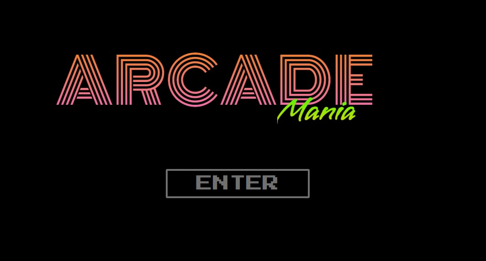
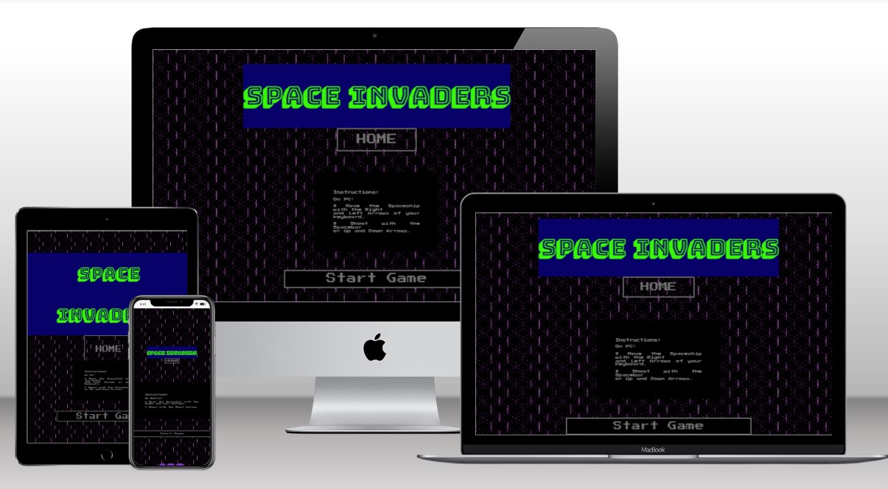
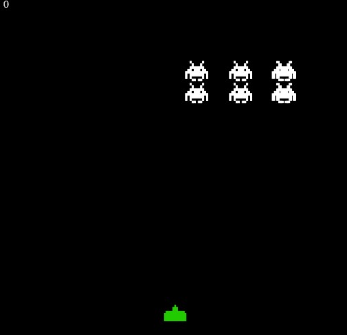
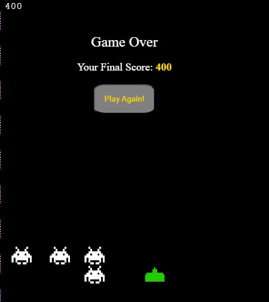
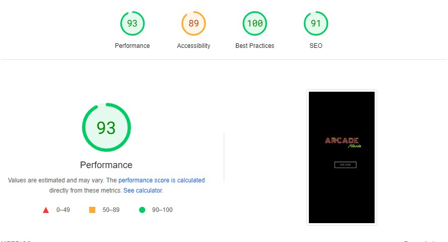
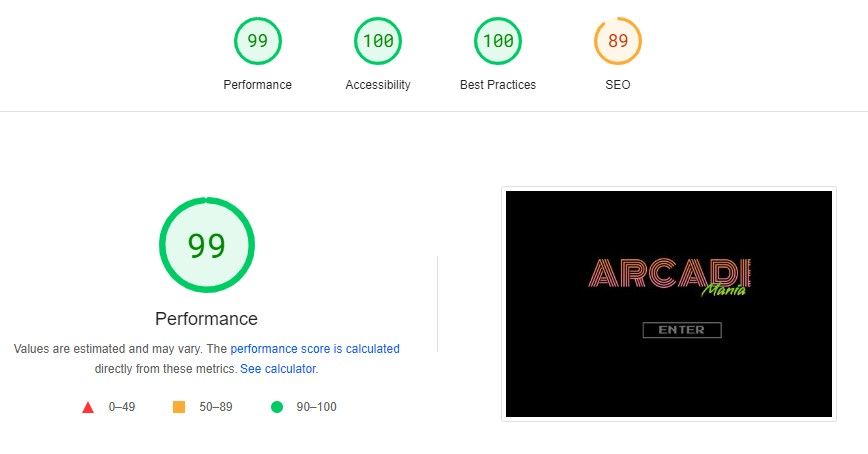

# Project 2 - Arcade

[ArcadeMania Website](https://danylc91.github.io/project2-arcade/)

## Overview

Created for Code Institute project 2, ArcadeMania is a retro looking website, hosting a versions of the memorable arcade game Space Invaders. With 80's vibes, bright colors, and simplistic animations, to bring nostalgia to the users.

## Features

HTML, CSS, Javascript based website, with a landing page and a game hosting page.

### Landing Page:
Users are greeted with a simple landing page featuring a title and an "Enter" button, reminiscent of classic console videogame designs. Clicking the "Enter" button directs users to the Space Invaders game.

### Space Invaders Game:
The game takes place on a black board with moving aliens. The user's ship can move horizontally and shoot at the aliens to defeat them. Each hit on an alien ship adds 100 points to the user's score. As the levels progress, the number of aliens multiplies, and their pace increases.

### 404 Error Page:
In the event that a user encounters a page not found error, the 404 Error page provides a friendly and informative message. It apologizes for the inconvenience and suggests navigating back to the homepage providing a link.

### Responsive Design:
The responsive design ensures that users can enjoy the Space Invaders game without compromise, regardless of the device they choose.

### Button Functionality:
Every button embedded within the website performs its designated function flawlessly.With virtual key added for gameplay on Mobile devices.

## Technologies Used

- __Google Fonts:__ Used for typography on the website.
- __Gitpod:__ Integrated development environment used for coding.
- __Youtube (tutorials):__ Referenced for learning and tutorials during development.
- __W3C Markup Validator:__ Ensured HTML code compliance with W3C standards.
- __W3C CSS Validator:__ Checked CSS code for adherence to W3C specifications.
- __Google Lighthouse:__ Used for performance, best practices, accessibility, and SEO testing.

## Functionality

- All links have been tested for hover and click functionality to ensure accessibility.
- Pages load correctly on various devices.
- All images load as intended on each page.
- Buttons across the site function correctly and direct users to their intended destinations.

## Development Issues

__Resizing for Mobile Interaction:__ Challenges were encountered in optimizing the game for mobile interaction, impacting the user experience.

## Credits

- __W3Schools:__ Referenced for learning and understanding web development concepts.
- __Youtube channel Kenny Yip Coding:__ Utilized for tutorials and additional learning resources.
